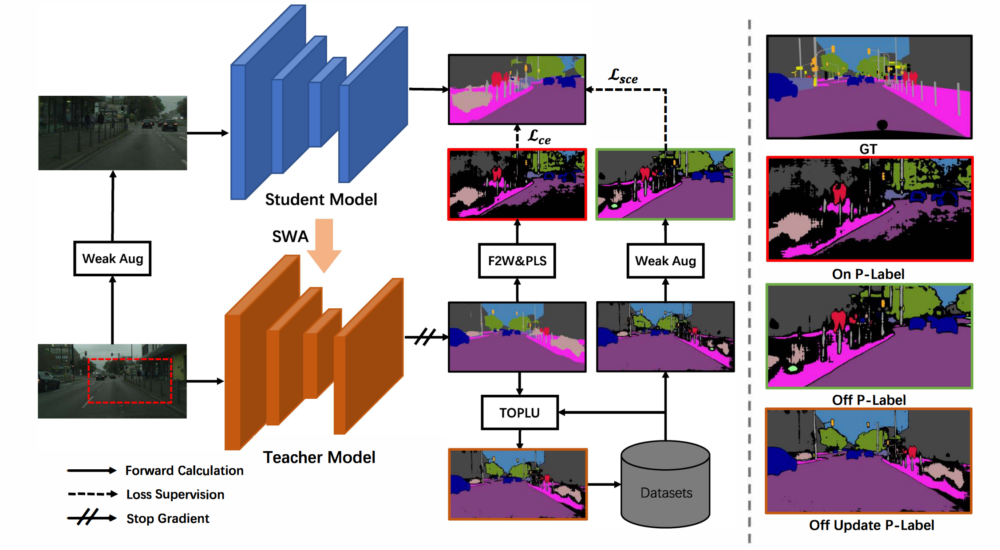

# DUDA-Online-Offline-Dual-Domain-Adaption-for-Semantic-Segmentation

<p align="center"> 
    
</p> 

 ### Abstract

 Self-training-based methods have achieved superior performance on unsupervised domain adaptive semantic segmentation task. However, these methods severely suffer from noisy pseudo label assignment. In this paper, we propose a simple yet effective dual pseudo label updating method that employs both online and offline mechanisms to dynamically update the two groups of pseudo labels. The online updating module employs a mean model to generate pseudo labels on-the-fly while the offline updating module capitalizes on the temporal consistency information to correct noisy labels. Furthermore, we present an online-offline dual regularization to further improve the noise-tolerant ability of the model. Combining the online-offline dual updating and online-offline dual regularization, we propose a novel mean-teacher based framework dubbed \textit{Online-Offline Dual Domain Adaption} (DUDA). Experiments show the proposed DUDA brings large performance gain and achieves state-of-the-art performance on two challenging benchmarks: GTA-to-Cityscapes and SYNTHIA-to-Cityscapes ($58.4\%$ mIoU and $59.7\%$ mIoU respectively).


### Introduce

1. Download Citysacpe, GTAV and Synthia datasets
```bash
ln -s your-cityscapes-dataset-path ./data/Cityscapes
cd dataset/Cityscapes
cp -r ./leftImg8bit/train/*/*leftImg8bit.png ./train/masks/
cp -r ./gtFine/train/*/*labelTrainIds.png ./train/masks/

cp -r ./leftImg8bit/valid/*/*leftImg8bit.png ./valid/masks/
cp -r ./gtFine/valid/*/*labelTrainIds.png ./valid/masks/
```

2. The pseudo label and warmup model are upload at [Baidu Cloud](https://pan.baidu.com/s/1mIJtOiS2B9Pkm_B1YV-trQ?pwd=r26y) and the code is r26y.

3. training:
```bash
python train.py --cfg ./configs/syn2cityscapes/IAST/self_train_res101_update.yaml
```

4. evaluation
```bash
python eval.py --cfg ./configs/syn2cityscapes/IAST/self_train_res101_update.yaml
```